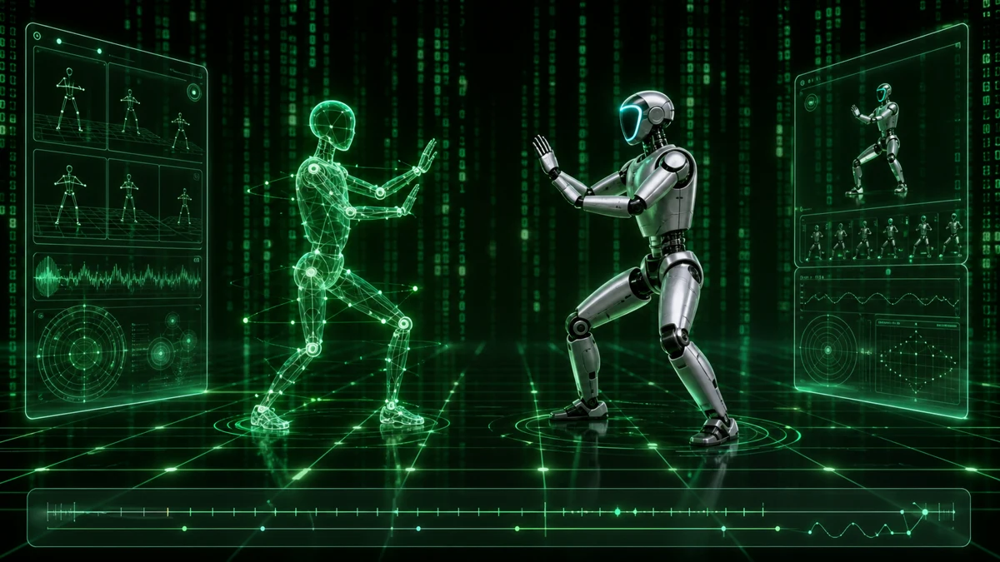
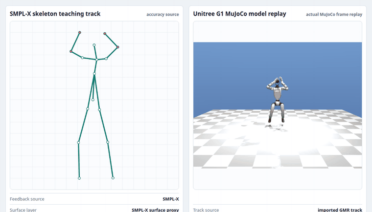
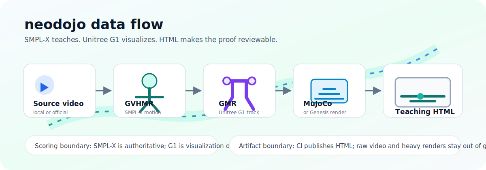

# neodojo

[](https://github.com/MiaoDX/neodojo/actions/workflows/public-demo.yml)


**English** · [中文](README.zh.md)



> "This is the Construct. It's our loading program. We can load anything, from clothing, to equipment, weapons, training simulations..."
>
> — Morpheus, *The Matrix* (1999)

**I know kung fu.**

Twenty-seven years later, we can build a real Construct.

Not for loading weapons. Not for loading combat programs. This Construct loads
Baduanjin, Wu Qin Xi, Yi Jin Jing, and eventually any human movement practice
that benefits from seeing the standard form.

neodojo is a simulation training dojo for kung fu in its broadest sense:
qigong, taichi, traditional martial arts, daoyin, rehabilitation drills, and
beyond. It converts instructional videos into motion tracks, retargets them to
a humanoid in simulation, and renders the result from multiple angles with
joint paths and synchronized playback.

You see the standard shadow of a move, then load that shadow into your own
training loop.



## What You Can Open

| Artifact | Link |
| --- | --- |
| Live fixture demo | [`miaodx.com/neodojo`](https://miaodx.com/neodojo/) |
| CI fixture HTML | `neodojo-public-demo` in the [`public-demo` workflow](https://github.com/MiaoDX/neodojo/actions/workflows/public-demo.yml) |
| CI sample-backed real HTML | `neodojo-real-demo-public-demo` in the same workflow |
| Local sample-backed real HTML | `outputs/real-demo/public-demo/index.html` after `make ci-real-demo` |
| Local routine HTML | `outputs/routines/<routine>/html/index.html` after the routine split/assemble commands |

The committed Baduanjin sample includes a small trimmed source clip plus the
derived GVHMR/GMR JSON needed to rebuild the demo. Larger source videos should
stay out of git and be fetched by helper scripts for local testing.

## Pipeline



`source video -> GVHMR SMPL-X -> GMR Unitree G1 -> MuJoCo/Genesis -> teaching UI`

SMPL-X is the teaching and scoring source. Unitree G1 is the visual companion,
not the judge.

## Try It

Use `make ci-real-demo` for the sample-backed real HTML and `make verify` for
the bootstrap verification surface. Full command details live in
[`STATUS.md`](STATUS.md).

For the three tracked Bilibili sources, the local routine orchestration path is:

```bash
make bilibili-download BILIBILI_DRY_RUN=1
make bilibili-download BILIBILI_DRY_RUN=0 BILIBILI_COOKIES_FROM_BROWSER=chrome
make routine-split ROUTINE=baduanjin ROUTINE_SOURCE_VIDEO=video/bilibili/01_baduanjin-complete-routine-with-breathing-cues.mp4 ROUTINE_DRY_RUN=0
make routine-prepare-gpu ROUTINE=baduanjin
make routine-assemble ROUTINE=baduanjin
make routine-smoke ROUTINE=baduanjin
```

This prepares local phase clips and per-phase GVHMR/GMR handoffs. It does not
vendor or run GVHMR, GMR, checkpoints, MuJoCo/Genesis mesh rendering, or a live
published real routine demo.

## Contributing

The dojo is not the place. The dojo is the practice.

Issues, PRs, ideas, and field notes are welcome. At this stage, every piece of
feedback can shape the project.

- Practitioners: the details your teacher can say but a flat video cannot show
  are exactly what this project needs.
- HMR and humanoid researchers: review the roadmap and suggest better
  reconstruction, retargeting, rendering, or evaluation approaches.
- roboharness and AI-coding-agent builders: this is an open experiment in
  agent-assisted simulation tooling.

**Show me.**

## Docs

- [`STATUS.md`](STATUS.md) - current truth, commands, blockers, CI evidence
- [`ARCHITECTURE.md`](ARCHITECTURE.md) - subsystem boundaries and contracts
- [`docs/runbooks/gvhmr-local-gpu.md`](docs/runbooks/gvhmr-local-gpu.md) - local GPU handoff
- [`docs/technical-roadmap.md`](docs/technical-roadmap.md) - technical research
- [`docs/humanoid-platform-evaluation.md`](docs/humanoid-platform-evaluation.md) - SMPL-X + G1 rationale

## License

MIT. See [`LICENSE`](LICENSE).
