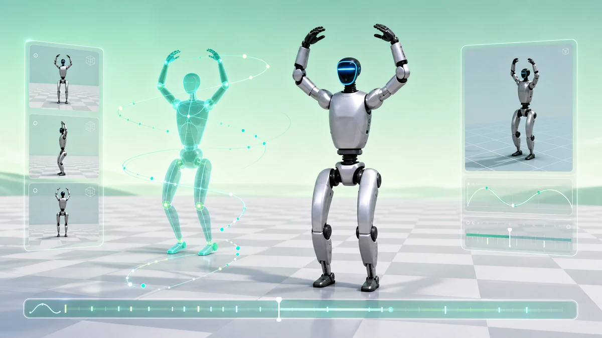

# neodojo

[](https://github.com/MiaoDX/neodojo/actions/workflows/public-demo.yml)


[English](README.md) · **中文**



neodojo 把官方或用户提供的教学动作视频转成可多视角检查的仿真教学回放。
教学与评分来源是 SMPL-X motion；Unitree G1 是同步视觉伴随轨道，不作为评分来源。

## 为什么做

教学视频容易观看，但很难逐帧检查。neodojo 保留人体教学轨道，把动作重定向到
humanoid visual track，再把两者打包成可以本地或 CI 打开的 HTML artifact。


## 当前证明

- 在线 fixture public demo: [`https://miaodx.com/neodojo/`](https://miaodx.com/neodojo/)
- CI real-demo artifact: [`public-demo` workflow](https://github.com/MiaoDX/neodojo/actions/workflows/public-demo.yml)
  里的 `neodojo-real-demo-public-demo`
- 本地 real-demo HTML: 运行 `make ci-real-demo` 后的
  `outputs/real-demo/public-demo/index.html`
- Sample input:
  [`samples/baduanjin-03-006-two-hands-80-92`](samples/baduanjin-03-006-two-hands-80-92)

提交的 sample 只包含派生 JSON：source provenance、返回的 GVHMR SMPL-X joints、
normalized GMR Unitree G1 joint angles。CI 会从这些 JSON 重新生成 G1 model
descriptor、MuJoCo frames、browser smoke capture 和 public HTML。Raw video、
checkpoints、pickles、rendered frame outputs 仍然不进 git。

## Pipeline


```text
source video -> GVHMR SMPL-X -> GMR Unitree G1 -> MuJoCo/Genesis -> teaching UI
```

## 运行

```bash
make verify
make demo-public-browser
make ci-real-demo
make ci-real-demo \
  CI_REAL_SOURCE_MATERIALIZATION=path/to/source-materialization.json \
  CI_REAL_GVHMR_JSON=path/to/gvhmr-smplx-joints.json \
  CI_REAL_GMR_G1_JSON=path/to/gmr-unitree-g1.json
```

MuJoCo 的 CI/local parity 使用 `MUJOCO_GL=glfw` 配合 `xvfb-run -a`。`osmesa`
是安装 system libraries 后的 CPU headless fallback；`egl` 适合可用 EGL 的
GPU/self-hosted runner。

## HTML 链接

| Target | 打开方式 |
| --- | --- |
| 在线 fixture HTML | [`miaodx.com/neodojo`](https://miaodx.com/neodojo/) |
| CI fixture artifact | [`public-demo` workflow](https://github.com/MiaoDX/neodojo/actions/workflows/public-demo.yml) 里的 `neodojo-public-demo` |
| CI sample-backed real HTML | [`public-demo` workflow](https://github.com/MiaoDX/neodojo/actions/workflows/public-demo.yml) 里的 `neodojo-real-demo-public-demo` |
| 本地 fixture HTML | `make demo-public-browser` 后的 `outputs/public-demo/index.html` |
| 本地 sample-backed real HTML | `make ci-real-demo` 后的 `outputs/real-demo/public-demo/index.html` |

## 状态

这个 repo 仍处于 bootstrap 阶段。它已有 fixture motion contracts、sample-backed
Baduanjin real-demo CI lane、roboharness-style G1 MuJoCo replay、browser smoke、
capture bundles，以及本地 GVHMR/GMR handoff boundaries。它还没有提交到仓库的
GVHMR/GMR runtime environment、production Viser UI、已发布的 real-demo Pages
site，或完整 simulator runtime pipeline。

Baduanjin proof 的 source provenance 是 [`video/original_videos.md`](video/original_videos.md)
里的 public index item `03-006`，trim `80s-92s`。

## 文档

- [`STATUS.md`](STATUS.md) - 当前事实、命令、blockers、CI evidence
- [`ARCHITECTURE.md`](ARCHITECTURE.md) - subsystem boundaries 和 contracts
- [`docs/runbooks/gvhmr-local-gpu.md`](docs/runbooks/gvhmr-local-gpu.md) - local GPU handoff
- [`docs/technical-roadmap.md`](docs/technical-roadmap.md) - technical research
- [`docs/humanoid-platform-evaluation.md`](docs/humanoid-platform-evaluation.md) - SMPL-X + G1 rationale

## License

MIT. See [`LICENSE`](LICENSE).
